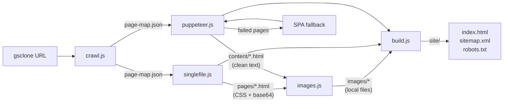
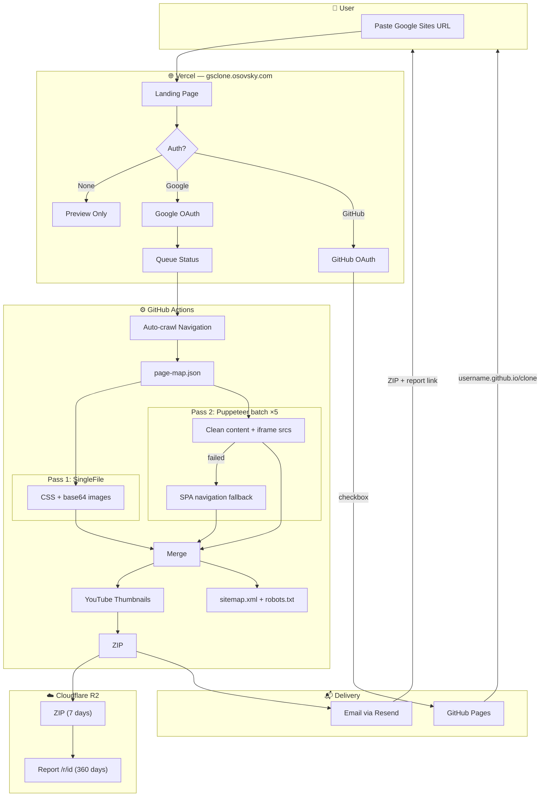
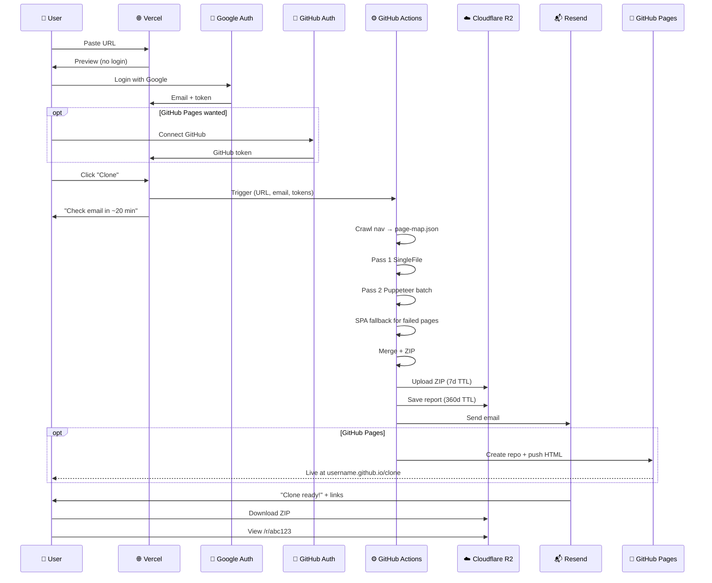

# 🏗️ google-sites-clone — Architecture

---

## ⚙️ CLI Pipeline

| Module | Input | Output |
|--------|-------|--------|
| `crawl.js` | URL | `page-map.json` (pages + hierarchy) |
| `singlefile.js` | page-map | `pages/*.html` (CSS + base64 images) |
| `puppeteer.js` | page-map | `content/*.html` (clean text + iframes) |
| `images.js` | pages/ + content/ | `images/*` (decoded files) + updated URLs |
| `build.js` | all above | `site/` (final HTML + sitemap + robots.txt) |

---

## 🌐 Product Architecture

---

## 🔄 Sequence Diagram

