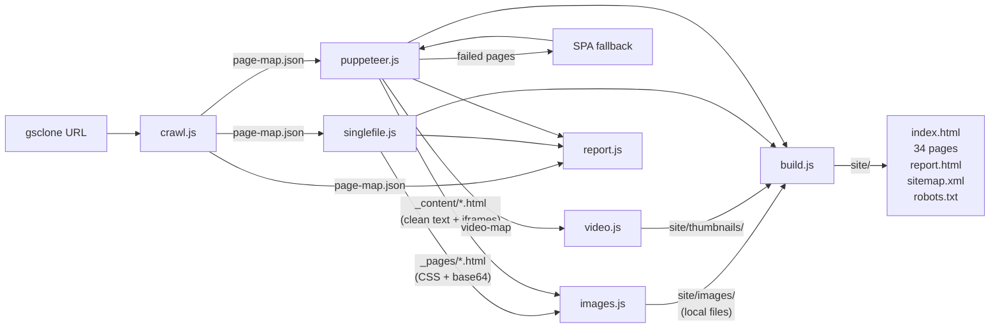
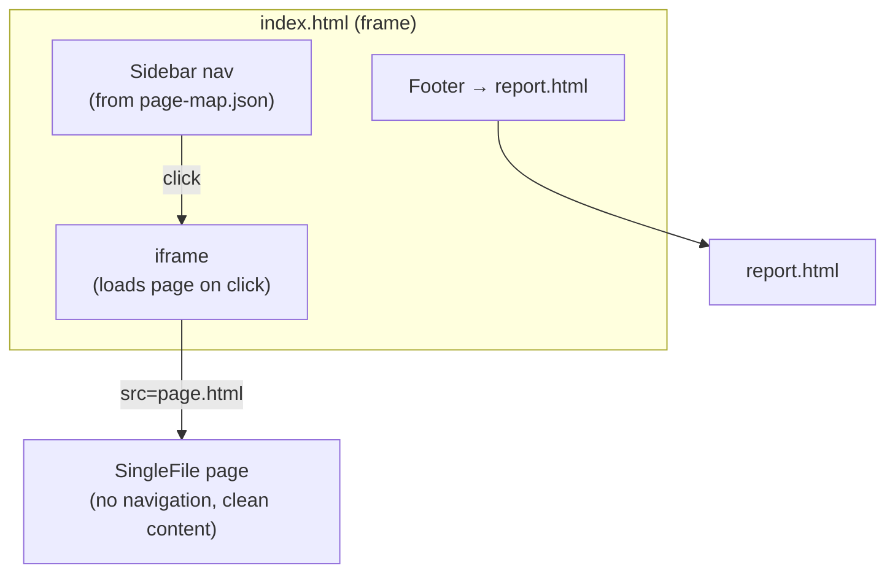
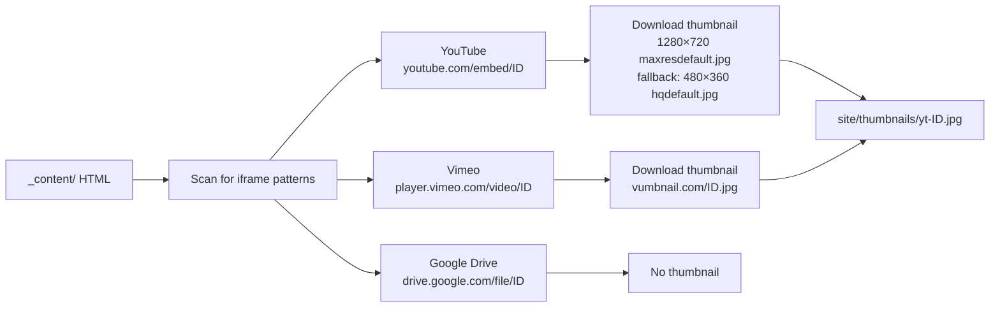
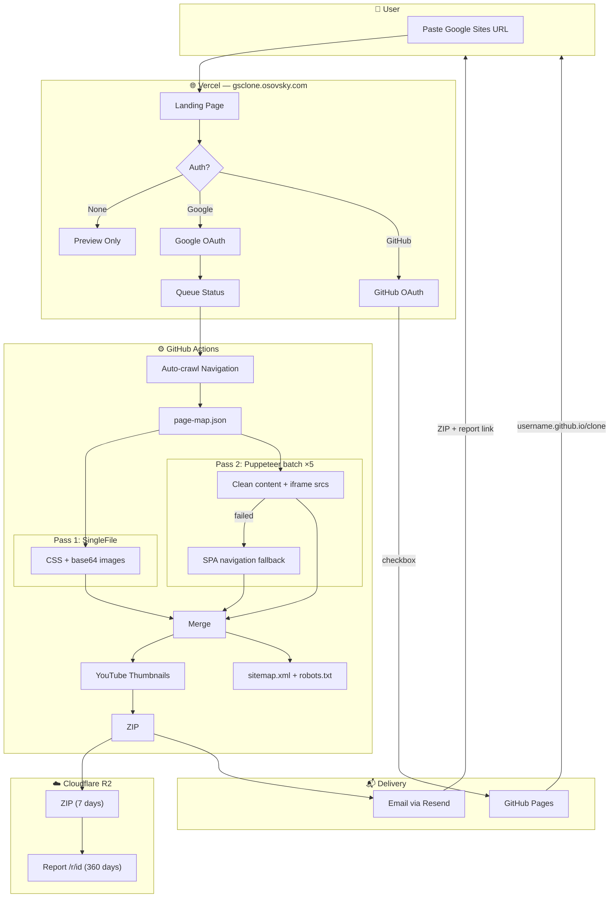

# 🏗️ google-sites-clone — Architecture

---

## ⚙️ CLI Pipeline



| Module | Input | Output |
|--------|-------|--------|
| `crawl.js` | URL | `page-map.json` (pages + hierarchy) |
| `singlefile.js` | page-map | `_pages/*.html` (CSS + base64 images) |
| `puppeteer.js` | page-map | `_content/*.html` (clean text + iframes) |
| `images.js` | _pages/ + _content/ | `site/images/*` (decoded files) |
| `video.js` | _content/ | `site/thumbnails/*` (YT/Vimeo thumbs) |
| `build.js` | all above | `site/` (index.html + iframe nav + pages) |
| `report.js` | page-map + _pages/ + _content/ | `report.html` (comparison dashboard) |

---

## 📂 Output Structure

```
clone-output/
├── page-map.json              ← Step 1: Crawl
├── _pages/                    ← Step 2: SingleFile
│   ├── shematizatiy.html         (full HTML, ~7 MB)
│   └── ...                       (32 files)
├── _content/                  ← Step 3: Puppeteer
│   ├── shematizatiy.html         (clean content, ~9 KB)
│   └── ...                       (34 files)
└── site/                      ← Step 5: Build
    ├── index.html                (sidebar + iframe nav)
    ├── report.html               (clone report dashboard)
    ├── shematizatiy.html         (SF copy — loaded in iframe)
    ├── ...                       (34 page files)
    ├── images/                   (base64 → local files)
    │   └── img-001.jpg ... img-046.jpg
    ├── thumbnails/            ← Step 4b: Video
    │   └── yt-VIDEO_ID.jpg       (1280×720, fallback 480×360)
    ├── sitemap.xml
    └── robots.txt
```

---

## 🔑 Navigation Architecture

The cloned site uses an **iframe-based** navigation model:



- **`index.html`** = sidebar navigation (from page-map.json) + `<iframe>`
- **Pages** = clean SingleFile HTML copies (no injected nav = no CSS conflicts)
- **Click sidebar** → changes `iframe.src` → page loads on right
- **Mobile** = hamburger ☰ toggles sidebar

---

## 📺 Video Pipeline



Thumbnails replace `<iframe>` placeholders with clickable images + play button overlay.

---

## 🌐 Product Architecture


