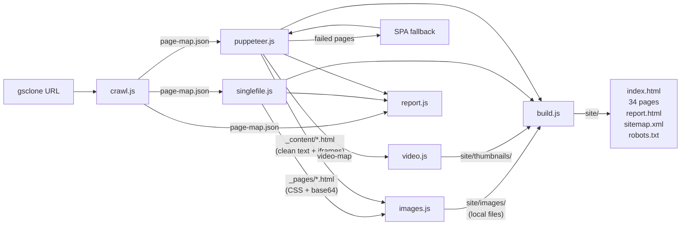
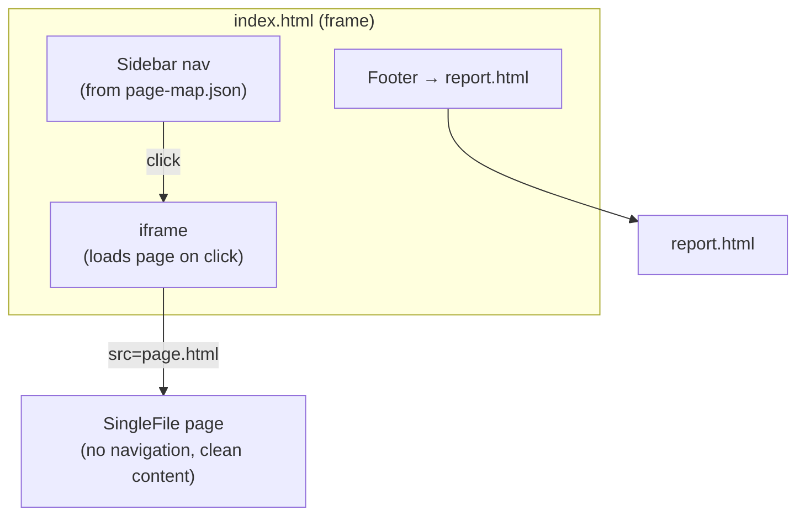
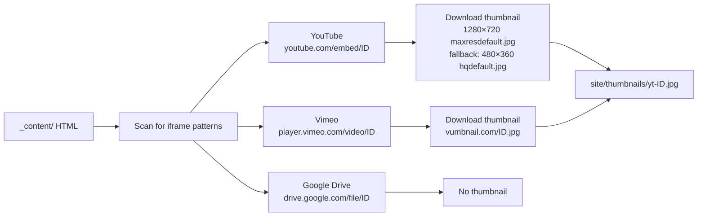
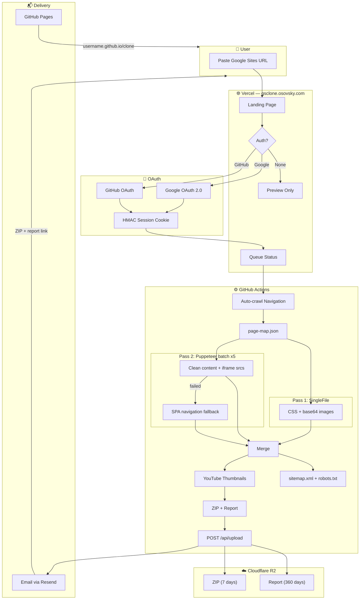

# 🏗️ google-sites-clone — Architecture

[](https://www.npmjs.com/package/google-sites-clone)
---

## ⚙️ CLI Pipeline



| Module | Input | Output |
|--------|-------|--------|
| `crawl.js` | URL | `page-map.json` (pages + hierarchy) |
| `singlefile.js` | page-map | `_pages/*.html` (CSS + base64 images) |
| `puppeteer.js` | page-map | `_content/*.html` (clean text + iframes) |
| `images.js` | _pages/ + _content/ | `site/images/*` (decoded files) |
| `video.js` | _content/ | `site/thumbnails/*` (YT/Vimeo thumbs) |
| `build.js` | all above | `site/` (index.html + iframe nav + pages + video grid) |
| `report.js` | page-map + _pages/ + _content/ | `report.html` (comparison dashboard) |

---

## 🔐 SaaS API (Vercel Serverless)

```
site/api/
├── _session.js            ← HMAC session helper (Node.js crypto)
├── _r2.js                 ← Cloudflare R2 upload/download (S3 SDK)
├── _email.js              ← Resend email helper
├── auth-google.js         ← Redirect → Google OAuth consent
├── auth-google-callback.js ← Exchange code → set session cookie
├── auth-github.js         ← Redirect → GitHub OAuth
├── auth-github-callback.js ← Exchange code → set session cookie
├── auth-me.js             ← GET current user from cookie
├── auth-logout.js         ← Clear session cookie
├── clone.js               ← POST → trigger GitHub Actions + email
├── upload.js              ← POST webhook → R2 upload + send email
└── download.js            ← GET → presigned R2 download URL
```

| Route | Method | Auth | Purpose |
|-------|--------|------|---------|
| `/api/auth-google` | GET | — | Redirect to Google consent |
| `/api/auth-google-callback` | GET | — | Exchange code, set cookie |
| `/api/auth-github` | GET | — | Redirect to GitHub auth |
| `/api/auth-github-callback` | GET | — | Exchange code, set cookie |
| `/api/auth-me` | GET | Cookie | Return current user |
| `/api/auth-logout` | GET | — | Clear session, redirect |
| `/api/clone` | POST | Optional | Trigger clone pipeline |
| `/api/upload` | POST | WEBHOOK_SECRET | Receive ZIP + report → R2 + email |
| `/api/download` | GET | — | Redirect to presigned R2 URL |

---

## 📂 Output Structure

```
clone-output/
├── page-map.json              ← Step 1: Crawl
├── _pages/                    ← Step 2: SingleFile
│   ├── shematizatiy.html         (full HTML, ~7 MB)
│   └── ...                       (32 files)
├── _content/                  ← Step 3: Puppeteer
│   ├── shematizatiy.html         (clean content, ~9 KB)
│   └── ...                       (34 files)
└── site/                      ← Step 5: Build
    ├── index.html                (sidebar + iframe nav)
    ├── report.html               (clone report dashboard)
    ├── shematizatiy.html         (SF copy — loaded in iframe)
    ├── ...                       (34 page files)
    ├── images/                   (base64 → local files)
    │   └── img-001.jpg ... img-046.jpg
    ├── thumbnails/            ← Step 4b: Video
    │   └── yt-VIDEO_ID.jpg       (1280×720, fallback 480×360)
    ├── sitemap.xml
    └── robots.txt
```

---

## 🔑 Navigation Architecture

The cloned site uses an **iframe-based** navigation model:



- **`index.html`** = sidebar navigation (from page-map.json) + `<iframe>`
- **Pages** = clean SingleFile HTML copies (no injected nav = no CSS conflicts)
- **Click sidebar** → changes `iframe.src` → page loads on right
- **Mobile** = hamburger ☰ toggles sidebar

### Root Page Filtering

The crawler marks the root page as `file: "index.html"` in page-map.json. Since `build.js` generates its own `index.html` (navigation shell), entries with `file === 'index.html'` are excluded from the content build loop and sidebar navigation.

---

## 📺 Video Pipeline



Thumbnails replace `<iframe>` placeholders with clickable images + play button overlay.

### Video Grid (build.js → SF pages)

SingleFile pages don't contain `data-iframe-src` placeholders (SingleFile strips iframes). To restore videos:

1. `buildVideoGrid()` reads the matching `_content/` file for each SF page
2. Extracts YouTube/Vimeo IDs using the same regex patterns as `video.js`
3. Checks `site/thumbnails/` for downloaded thumbnail files
4. Generates an inline-styled CSS Grid with clickable thumbnails (or text fallback)
5. Injects the grid right after `<body>` in the SF HTML

Key design decisions:
- **`all:initial`** on the container — resets all inherited SF styles, isolates the grid
- **Inline styles only** — no `<style>` block needed, no CSS conflicts with SF
- **`auto-fill, minmax(200px, 1fr)`** — responsive 1–4 columns depending on width

---

## 🌐 Product Architecture



### Auth Flow

1. User clicks Google/GitHub icon → redirects to `/api/auth-google` or `/api/auth-github`
2. OAuth provider redirects back to callback URL with authorization code
3. Callback exchanges code for access token, fetches user profile
4. HMAC-signed session cookie set (`HttpOnly`, `Secure`, `SameSite=Lax`, 30 days)
5. Frontend calls `/api/auth-me` on page load → restores avatar and pre-fills email

### Storage + Email Flow

1. GitHub Actions completes clone → POSTs ZIP (base64) + report HTML to `/api/upload`
2. Upload handler stores ZIP in R2 (`zips/{id}.zip`, TTL 7d) and report (`reports/{id}.html`, TTL 360d)
3. Sends email via Resend with presigned download links
4. `/api/download?id=xxx&type=zip` redirects to presigned R2 URL

### Environment Variables

| Variable | Service |
|----------|---------|
| `GOOGLE_CLIENT_ID`, `GOOGLE_CLIENT_SECRET` | Google Cloud Console |
| `GITHUB_CLIENT_ID`, `GITHUB_CLIENT_SECRET` | GitHub Developer Settings |
| `JWT_SECRET` | Random 32+ char string |
| `R2_ACCOUNT_ID`, `R2_ACCESS_KEY_ID`, `R2_SECRET_ACCESS_KEY` | Cloudflare R2 |
| `R2_BUCKET` | Bucket name (e.g. `gsclone`) |
| `RESEND_API_KEY`, `RESEND_FROM` | Resend |
| `WEBHOOK_SECRET` | Shared secret for Actions → upload |
| `GITHUB_TOKEN` | GitHub PAT for workflow dispatch |
