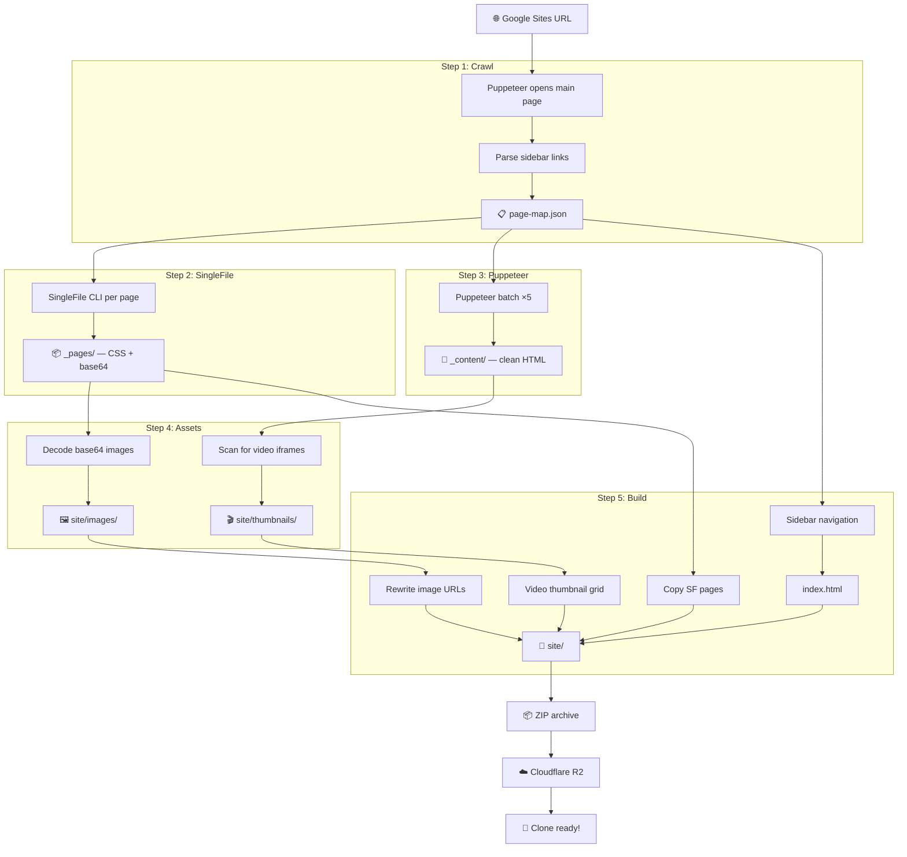

<div align="center">


# 🌐 Google Sites Clone


**Clone any Google Sites page to static HTML — own your content forever**

[Quick Start](#-quick-start) · [Features](#-features) · [How It Works](#-how-it-works) · [Pipeline](#-pipeline) · [Tech Stack](#-tech-stack) · [npm](https://www.npmjs.com/package/google-sites-clone) · [Roadmap](ROADMAP.md)

</div>

> *No more vendor lock-in. Your Google Sites content belongs to you. Paste a URL, get a complete static clone with all images, styles, and navigation — ready for self-hosting.*

---

## 💡 Concept

Google Sites stores your content behind an SPA that search engines can't index and you can't export. **google-sites-clone** uses a two-pass pipeline (SingleFile + Puppeteer) to capture everything — CSS fidelity from SingleFile and clean semantic content from Puppeteer — then merges both into standalone HTML files with localized images and SEO metadata.

---

## ✨ Features

| Feature | Description |
|---------|-------------|
| 🔍 Auto-crawl | Discovers all pages from sidebar navigation automatically |
| 🎨 Two-pass pipeline | SingleFile for CSS/images + Puppeteer for clean content |
| 🖼️ Image localization | Downloads all images as local files (no CDN dependency) |
| 📺 YouTube thumbnails | Converts embedded iframes to clickable thumbnails |
| 🎬 Video grid | Injects CSS Grid of video thumbnails into SingleFile pages |
| 🗺️ SEO ready | Generates `sitemap.xml` + `robots.txt` |
| ⚡ Batch processing | 5 pages per batch with anti-rate-limit pauses |
| 🔄 SPA fallback | Internal navigation for pages that fail direct URL loading |
| 🚀 GitHub Pages deploy | One command to push to gh-pages branch |
| 📦 ZIP export | Create downloadable archive of cloned site |

---

## 🚀 Quick Start

### 🌐 Web (no install)

Clone any Google Site at [**gsclone.osovsky.com**](https://gsclone.osovsky.com) — sign in with Google, paste URL, get ZIP by email.

### 💻 CLI (developers)

> **Requires:** Node.js 18+, Chrome/Chromium. SingleFile CLI is auto-installed on first run (~30 MB).

```bash
npx google-sites-clone https://sites.google.com/view/your-site
```

📦 [View on npm](https://www.npmjs.com/package/google-sites-clone) · Installs: Puppeteer (~400 MB) + SingleFile CLI (~30 MB)

<details>
<summary>📋 Manual setup</summary>

```bash
git clone https://github.com/maximosovsky/google-sites-clone
cd google-sites-clone
npm install
node bin/gsclone.js https://sites.google.com/view/your-site
```

</details>

<details>
<summary>⚙️ CLI Options</summary>

```bash
gsclone <url> [options]

Options:
  -o, --output <dir>   Output directory (default: ./clone)
  --no-images          Skip image localization
  --no-youtube         Skip YouTube thumbnail download
  --serve              Start local server after build
  --custom-nav         Use custom sidebar navigation
  --inline             Keep images inline (base64)
  --zip                Create ZIP archive of site after build
```

</details>

<details>
<summary>🚀 Deploy to GitHub Pages</summary>

```bash
gsclone deploy ./clone/site --repo username/my-clone
```

Pushes `site/` to the `gh-pages` branch. Enable Pages in repo Settings → Pages → Branch: `gh-pages`.

</details>

---

## 🎫 Usage Tiers

| Tier | Auth | Clones | Max ZIP |
|------|------|--------|---------|
| **Free** | Google | 1 total | 250 MB |
| **Starred** | Google + GitHub + ⭐ repo | 5/day, 20/month | 250 MB |
| **Unlimited** | By request | ∞ | ∞ |

---

## 💡 How It Works

```
URL → [1. Crawl]      → page-map.json (~2 KB)
    → [2. SingleFile]  → _pages/ CSS + base64 (~7 MB/page)
    → [3. Puppeteer]   → _content/ clean content (~9 KB/page)
    → [4. Images]      → site/images/ decoded files
    → [4b. Video]      → site/thumbnails/ (~50 KB each)
    → [5. Build]       → site/ iframe nav + video grid + report
    → [6. ZIP]         → clone-result.zip (40–250 MB)
    → [7. R2 Upload]   → Cloudflare R2 (direct via aws s3 cp)
    → [8. Email]       → "Clone ready!" + download links
```

| Pass | Tool | Output | Size |
|------|------|--------|------|
| 1 | Puppeteer | `page-map.json` | ~2 KB |
| 2 | SingleFile CLI | `_pages/*.html` | ~7 MB/page |
| 3 | Puppeteer ×5 | `_content/*.html` | ~9 KB/page |
| 4 | Base64 decoder | `site/images/` | varies |
| 4b | Video scanner | `site/thumbnails/` | ~50 KB each |
| 5 | Build script | `site/` (nav + grid + report) | — |
| 6 | ZIP | `clone-result.zip` | up to 250 MB |
| 7 | AWS CLI | R2: `zips/` (7d auto-delete), `reports/` (360d auto-delete) | — |

---

## 🔧 Pipeline



---

## 🏗️ Tech Stack

| Layer | Technology |
|-------|------------|
| Runtime | Node.js 18+ |
| Content extraction | Puppeteer |
| CSS preservation | SingleFile CLI |
| CLI interface | Commander.js |
| Auth | Google OAuth 2.0, GitHub OAuth |
| Storage | Cloudflare R2 (S3-compatible) |
| Email | Resend |
| Hosting | Vercel (landing + API) |

```
google-sites-clone/
├── bin/
│   └── gsclone.js          # CLI entry point
├── lib/
│   ├── index.js            # Pipeline orchestrator
│   ├── crawl.js            # Auto-crawl navigation
│   ├── singlefile.js       # SingleFile pass
│   ├── puppeteer.js        # Puppeteer batch extraction
│   ├── images.js           # Base64 → local images
│   ├── video.js            # YouTube/Vimeo thumbnail download
│   ├── build.js            # iframe nav + page assembly
│   ├── report.js           # Clone report dashboard
│   ├── deploy.js           # GitHub Pages deploy
│   └── zip.js              # ZIP archive creation
├── rebuild.js              # Quick rebuild from cache
├── site/                   # Landing page (Vercel)
│   ├── index.html          # Landing page + auth UI
│   ├── style.css           # Design system
│   ├── vercel.json         # API rewrites
│   └── api/
│       ├── _session.js     # HMAC session helper
│       ├── _r2.js          # Cloudflare R2 helper
│       ├── _email.js       # Resend email helper
│       ├── auth-google.js  # Google OAuth redirect
│       ├── auth-github.js  # GitHub OAuth redirect
│       ├── auth-me.js      # Get current user
│       ├── auth-logout.js  # Clear session
│       ├── clone.js        # Trigger clone pipeline
│       ├── upload.js       # Webhook: R2 upload + email
│       └── download.js     # Presigned R2 download
├── ARCHITECTURE.md
├── MANUAL.md
├── ROADMAP.md
└── package.json
```

---

## 🗺️ Roadmap

See [ROADMAP.md](ROADMAP.md) for full details.

- [x] Core pipeline (SingleFile + Puppeteer)
- [x] CLI interface
- [x] Auto-crawl navigation
- [x] Image localization
- [x] iframe-based navigation (sidebar + content)
- [x] Clone report dashboard
- [x] YouTube/Vimeo thumbnail download
- [x] Video grid (YT/Vimeo/GDrive)
- [x] GitHub Pages deploy
- [x] ZIP export
- [x] npm publish
- [x] Rate limits + usage tiers (Free / Starred / Unlimited)
- [x] Email delivery (Resend)
- [x] Cloudflare R2 storage + lifecycle auto-cleanup
- [x] Real Google OAuth
- [x] Real GitHub OAuth

---

## 🔀 Alternatives

| Tool | Approach | Google Sites (new) |
|------|----------|--------------------|
| [HTTrack](https://github.com/xroche/httrack) | Recursive wget-style crawl | ❌ Can't execute JavaScript — downloads empty SPA shell |
| [google-sites-backup](https://github.com/famzah/google-sites-backup) | Google Sites API (GData) | ❌ Classic Sites only, API deprecated |
| [generate-static-site](https://github.com/lichtquelle/generate-static-site) | Headless SSR pre-render | ⚠️ Generic tool, no auto-crawl or Google Sites awareness |
| **google-sites-clone** | Puppeteer + SingleFile | ✅ Full SPA rendering, auto-crawl, CSS fidelity, image localization |

> New Google Sites (2020+) is a single-page application — all content is rendered by JavaScript. Traditional crawlers see an empty page. That's why this project uses a headless browser.

---

## 🤝 Contributing

Fork → `feature/name` → PR

---

## 📄 License

[Maxim Osovsky](https://www.linkedin.com/in/osovsky/). Licensed under MIT.
